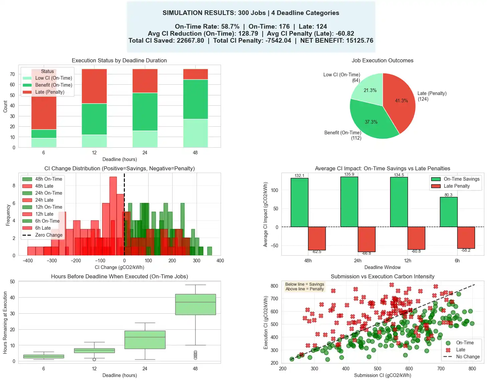

# Carbon Aware LLM

The project implements a full-stack Azure web application between a user and an Azure OpenAI LLM. The app allows the user an option to delay (temporally shift) prompts before they are entered into an LLM. The prompts are executed by the scheduler to run within a user-defined timeframe (e.g., "in the next 24 hours") based on the Carbon Intensity of the electricity grid (gathered via Electricity Maps API) associated with the processing data center. The performance of the developed scheduler and the reduction in carbon footprint are simulated based on historical data from 2024. 

See `Carbon_Aware_LLM_Project_Paper.pdf` for detailed explanation and analysis.

App deployed [Here](https://wonderful-flower-0e3ecf80f.2.azurestaticapps.net/) 

## Architecture 

## Simulation Results 

